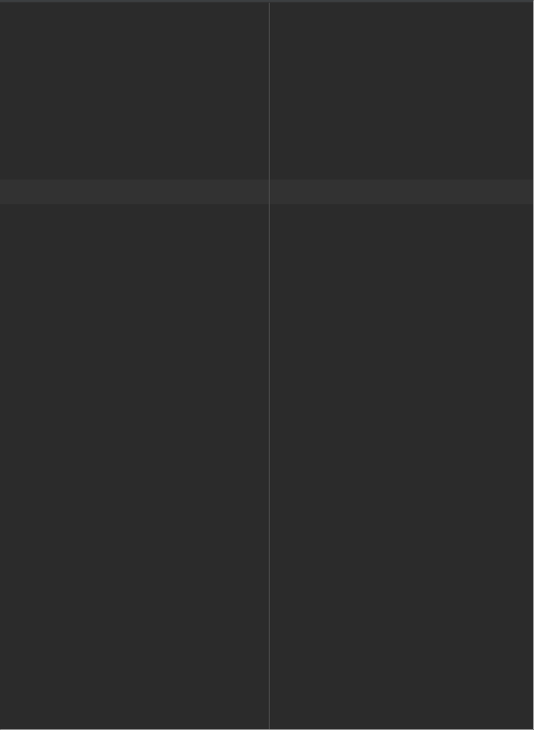

# Android Prework - *Garden App*

Submitted by: **Helen Glover**

**Garden App** is an android app that shows an image and introductory message, and allows pressing a button to display a Toast. 

Time spent: **2** hours spent in total

## Required Features

The following **required** functionality is completed:

- ✅ Image and introductory message displayed on screen
- ✅ Button displayed on screen
- ✅ Toast with message appears when button is pressed 

The following **optional** features are implemented:

Toimprove the app functionality, I can add a background color, add more pictures of the garden, and change the size of the text!

## Video Walkthrough

Here's a walkthrough of implemented features:

<!-- Replace this with whatever GIF tool you used! -->
GIF created with [LiceCap](http://www.cockos.com/licecap/).  

## Notes

- One of the biggest challenges was trying to set up the emulator. Thanks to the slides, I set up the Pixel 5 device which the app can run on.
- Another challenge was learning about the View Layouts to organize and position the app's elements. 

## License

    Copyright [2022] [Helen Glover]

    Licensed under the Apache License, Version 2.0 (the "License");
    you may not use this file except in compliance with the License.
    You may obtain a copy of the License at

        http://www.apache.org/licenses/LICENSE-2.0

    Unless required by applicable law or agreed to in writing, software
    distributed under the License is distributed on an "AS IS" BASIS,
    WITHOUT WARRANTIES OR CONDITIONS OF ANY KIND, either express or implied.
    See the License for the specific language governing permissions and
    limitations under the License.
