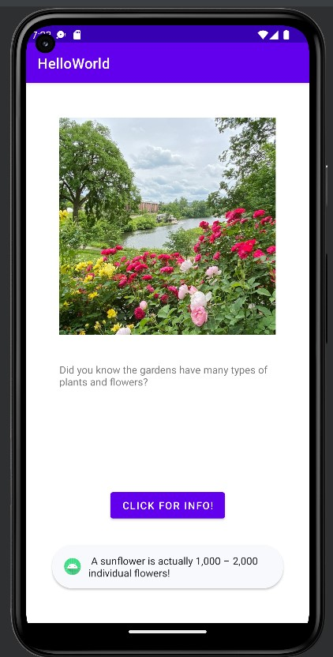

# AndroidApp

This is a beginner application using Andriod Studio. It was built with Kotlin.

## Process: 
### Step 1: Creating the Project
- Install and configure the local workstation 
- Organization of projects in Android Studio

### Step 2: Design and Customization
- Design, develop, and submit the first app: A simple garden app!
- Set up the Android emulator and learn how to run apps on it

### Step 3: User Interaction? 
- Build user interface using events listeners and handlers
- Understand layout designs and Views

